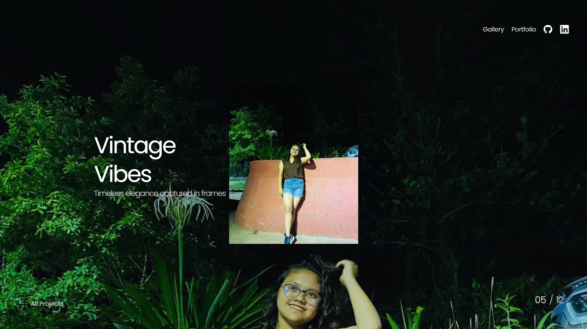

# Priyanka Interactive Portfolio

A modern, interactive portfolio website built with React, TypeScript, and GSAP animations.

## 🖼️ Preview




## 🚀 Features

- Smooth scrolling with Lenis
- GSAP animations for enhanced user experience
- Responsive design with Tailwind CSS
- Type-safe development with TypeScript
- Modern React with Hooks
- Framer Motion for animations

## 🛠️ Tech Stack

- **Frontend Framework:** React 18
- **Language:** TypeScript
- **Styling:** Tailwind CSS
- **Animation Libraries:**
  - GSAP
  - Framer Motion
- **Routing:** React Router DOM
- **Build Tool:** Vite
- **Linting:** ESLint
- **Package Manager:** npm

## 📦 Installation

1. Clone the repository:
```bash
git clone [your-repository-url]
```

2. Install dependencies:
```bash
npm install
```

3. Start the development server:
```bash
npm run dev
```

4. Build for production:
```bash
npm run build
```

## 🎯 Project Structure

```
src/
├── assets/         # Static assets
├── components/     # React components
├── utils/         # Utility functions
├── App.tsx        # Main application component
├── main.tsx       # Application entry point
└── index.css      # Global styles
```

## 🔧 Available Scripts

- `npm run dev` - Start development server
- `npm run build` - Build for production
- `npm run lint` - Run ESLint
- `npm run preview` - Preview production build

## 📝 License

This project is licensed under the MIT License - see the LICENSE file for details.

## 🤝 Contributing

Contributions are welcome! Please feel free to submit a Pull Request.
